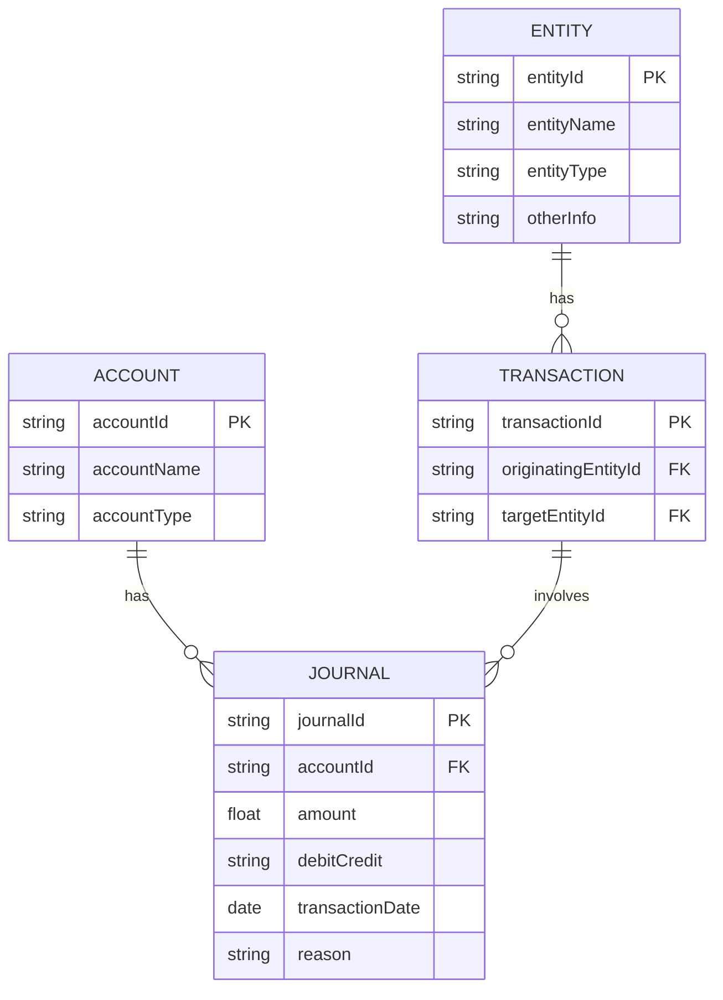

### 勘定科目テーブル:
科目ID
科目名
科目タイプ（資産、負債、収益、費用など）

### 仕訳テーブル:

仕訳ID
勘定科目ID（勘定科目テーブルとの関連）
金額
借方/貸方
取引日
仕分け理由（期末調整など）

### 主体テーブル:

主体ID
主体名
主体タイプ
その他情報

### 取引主体関連テーブル:

取引ID
発生主体ID
対象主体ID




### ポイントを送る
```sql
INSERT INTO 仕訳テーブル (勘定科目ID, 金額, 借方/貸方, 取引日, 仕分け理由)
VALUES
(/* 主体Aのポイント勘定科目ID */, /* 送るポイント量 */, '貸方', CURRENT_DATE, 'ポイント送付'),
(/* 主体Bのポイント勘定科目ID */, /* 受けるポイント量 */, '借方', CURRENT_DATE, 'ポイント受領');

INSERT INTO 取引主体関連テーブル (取引ID, 発生主体ID, 対象主体ID)
VALUES
(/* 新しい取引ID */, /* 主体AのID */, /* 主体BのID */);

```
#### トリガーを使用し、主体間取引が自動的に各主体仕訳を更新する
```sql
CREATE TRIGGER TransferPointsTrigger
AFTER INSERT ON 取引主体関連テーブル
FOR EACH ROW
BEGIN
   -- 主体Aのポイント減少を記録
   INSERT INTO 仕訳テーブル (勘定科目ID, 金額, 借方/貸方, 取引日, 仕分け理由)
   VALUES ((SELECT 科目ID FROM 勘定科目テーブル WHERE 科目名 = 'ポイント' AND 主体ID = NEW.発生主体ID),
           NEW.金額, '貸方', NEW.取引日, 'ポイント送付');

   -- 主体Bのポイント増加を記録
   INSERT INTO 仕訳テーブル (勘定科目ID, 金額, 借方/貸方, 取引日, 仕分け理由)
   VALUES ((SELECT 科目ID FROM 勘定科目テーブル WHERE 科目名 = 'ポイント' AND 主体ID = NEW.対象主体ID),
           NEW.金額, '借方', NEW.取引日, 'ポイント受領');
END;

```

```typescript

const T = {
const ACCOUNT = Type.Object({
    accountId: Type.String({ minLength: 1, maxLength: 50 }),
    accountName: Type.String({ minLength: 1, maxLength: 100 }),
    accountType: Type.String({ minLength: 1, maxLength: 50 }),
})

const JOURNAL = Type.Object({
    journalId: Type.String({ minLength: 1, maxLength: 50 }),
    accountId: Type.String({ minLength: 1, maxLength: 50 }),
    amount: Type.Number(),
    debitCredit: Type.String({ minLength: 1, maxLength: 10 }),
    transactionDate: Type.String({ format: 'date-time' }),
    reason: Type.String({ minLength: 1, maxLength: 200 }),
})

const ENTITY = Type.Object({
    entityId: Type.String({ minLength: 1, maxLength: 50 }),
    entityName: Type.String({ minLength: 1, maxLength: 100 }),
    entityType: Type.String({ minLength: 1, maxLength: 50 }),
    otherInfo: Type.Optional(Type.String({ minLength: 1, maxLength: 200 })),
})

const TRANSACTION = Type.Object({
    transactionId: Type.String({ minLength: 1, maxLength: 50 }),
    originatingEntityId: Type.String({ minLength: 1, maxLength: 50 }),
    targetEntityId: Type.String({ minLength: 1, maxLength: 50 }),
})
}

```