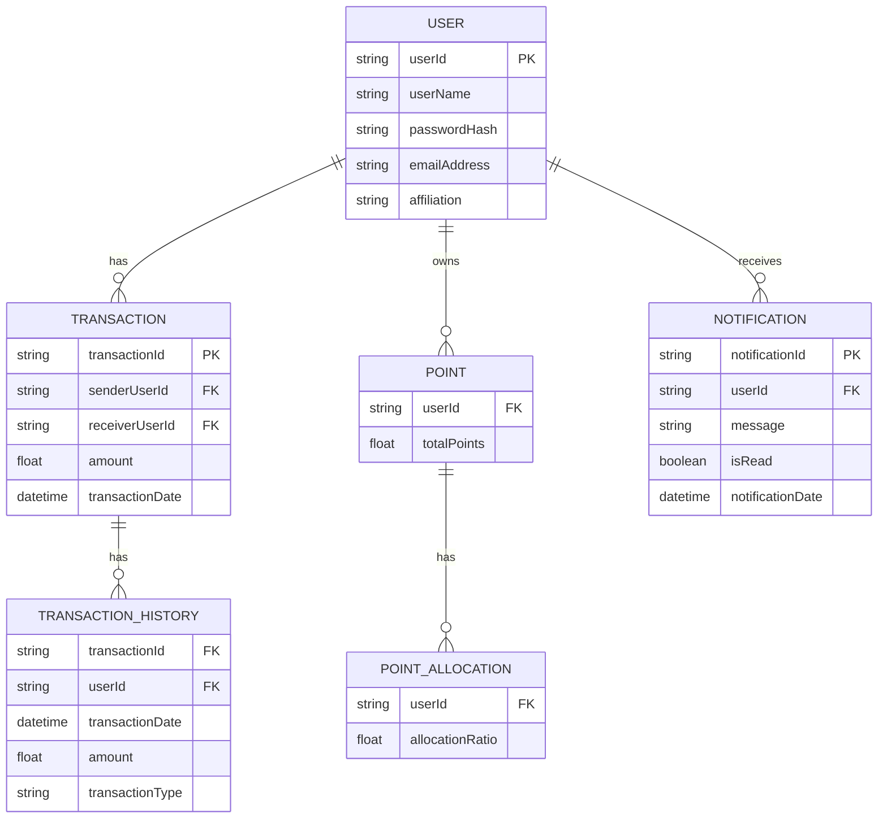

```typescript

const T = {
  // 販売会社マスタ (distributor_master)
  distributorBranchId: Type.String({ minLength: 1, maxLength: 20 }),
  distributorId: Type.String({ minLength: 1, maxLength: 3 }),
  branchId: Type.String({ minLength: 1, maxLength: 3 }),
  distributorName: Type.String({ minLength: 1, maxLength: 16 }),
  branchName: Type.String({ minLength: 1, maxLength: 16 }),

  // ロールマスタ (role_master)
  roleId: Type.Number(),
  categoryId: Type.Number(),
  roleType: Type.Number(),
  selectFlag: Type.Boolean(),
  roleName: Type.String({ minLength: 1, maxLength: 40 }),

  // 機種マスタ (model_master)
  model: Type.Number(),
  deviceName: Type.String({ minLength: 1, maxLength: 26 }),
  modelType: Type.String({ minLength: 1, maxLength: 26 }),
  modelId: Type.String({ minLength: 1, maxLength: 3 }),

  // エラーマスタ (error_master)
  errorCode: Type.String({ minLength: 1, maxLength: 6 }),
  errorGroupId: Type.Number(),
  errorGroup: Type.String({ minLength: 1, maxLength: 16 }),
  errorName: Type.String({ minLength: 1, maxLength: 50 }),

  // ユーザーマスタ (user_master)
  userId: Type.String({ minLength: 1, maxLength: 20 }),
  userName: Type.String({ minLength: 1, maxLength: 60 }),
  passwordHash: Type.String({ minLength: 1, maxLength: 255 }),
  emailAddress: Type.String({ minLength: 1, maxLength: 254 }),
  affiliation: Type.String({ minLength: 1, maxLength: 60 }),
  // distributorBranchId: Type.Optional(Type.String({ minLength: 1, maxLength: 20 })),
  passInitKey: Type.Optional(Type.String({ minLength: 1, maxLength: 64 })),
  passInitKeyLimit: Type.Optional(Type.String()), // timestamp with time zone

  // 顧客マスタ (customer_master)
  customerUserId: Type.String({ minLength: 1, maxLength: 20 }),
  salesUserId: Type.String({ minLength: 1, maxLength: 20 }),

  // 装置マスタ (machine_master)
  serialNumber: Type.String({ minLength: 1, maxLength: 9 }),
  // customerUserId: Type.String({ minLength: 1, maxLength: 20 }),
  destination: Type.String({ minLength: 1, maxLength: 150 }),
  // distributorBranchId: Type.String({ minLength: 1, maxLength: 20 }),
  serviceUserId: Type.String({ minLength: 1, maxLength: 20 }),
  startDate: Type.String(), // date
}

```